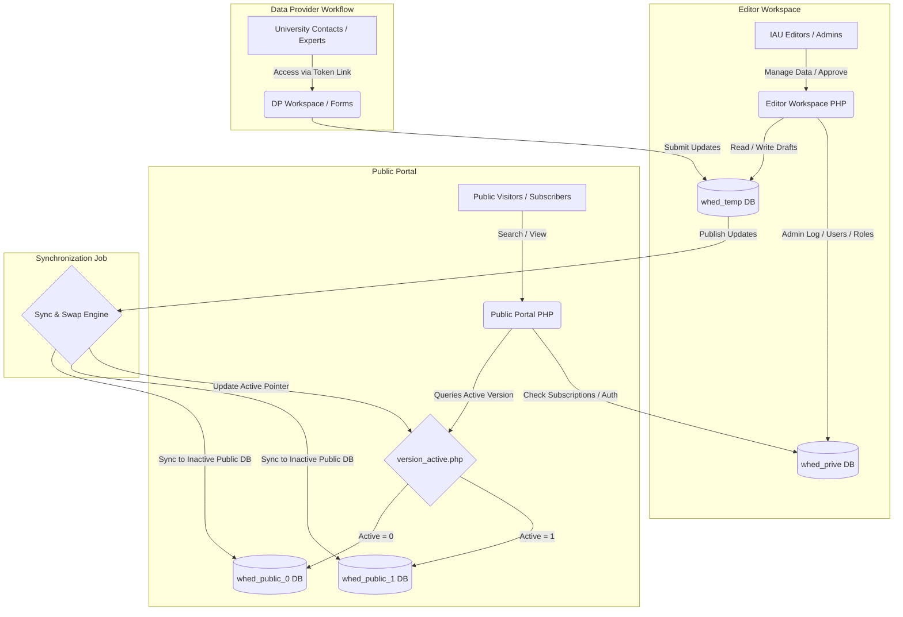
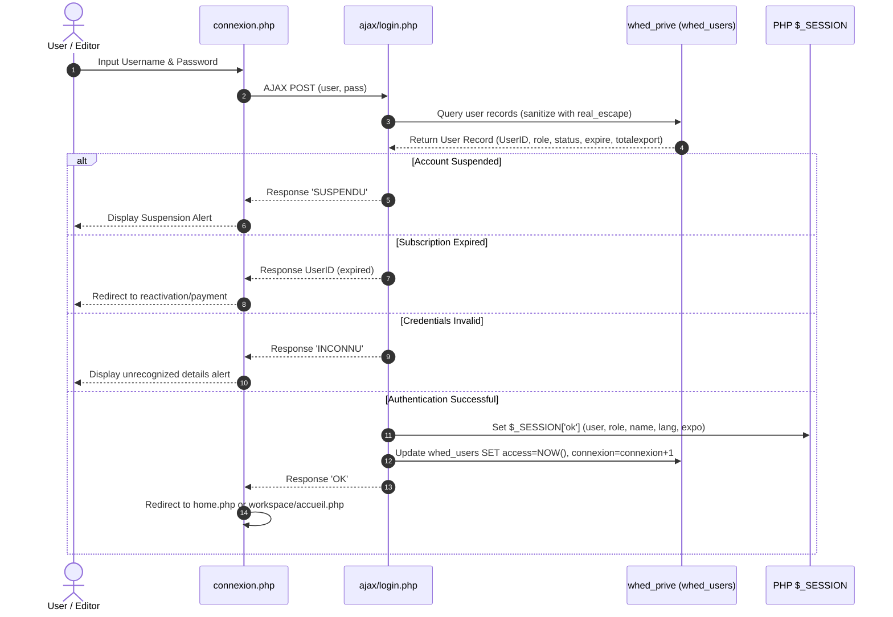

# WHED System Architecture and Database Relationship Documentation

This document provides a comprehensive technical overview of the **World Higher Education Database (WHED)** project. It details the project's architecture, its authentication and authorization models, its core database entities and relationships, and the workflow mechanisms that govern data updates and statistics.

---

## 1. High-Level Architecture Overview

The WHED project is built using a decoupled architecture separating the **Public Client Portal** (accessed by public users and subscribers) and the **Editor Workspace (Backoffice)** (accessed by administrators and IAU editors). The system is developed in **PHP** using a procedural structure with dynamic page generation and metadata-driven layout configuration.

### Deployment & Synchronization Strategy (Blue/Green Database Deployment)
To prevent search latency and avoid exposing incomplete edits to public visitors, the system implements a database replication and swap mechanism:
1. **`whed_temp`**: The draft database where editors prepare updates in the backoffice.
2. **`whed_public_0` & `whed_public_1`**: Two public-facing databases. One is marked active (live), and the other is inactive (backup/offline).
3. When updates in `whed_temp` are completed and validated by the IAU team:
   - The inactive database is updated/synchronized with the new data.
   - The active database pointer is toggled by rewriting the active database version in [httpdocs/include/version_active.php](file:///c:/Users/Win%2011/Downloads/whed-codebase-client_php/httpdocs/include/version_active.php).
   - This ensures zero-downtime publishing and instant rollback capabilities.



---

## 2. Authentication and Authorization Model

The WHED project features a multi-tiered security model securing both frontend subscriber content and backend editorial workflows.

### 2.1 User Roles & Session Management
All authentication details are verified against the central private database `whed_prive` via the table `whed_users`. 

When a user initiates login via [httpdocs/include/connexion.php](file:///c:/Users/Win%2011/Downloads/whed-codebase-client_php/httpdocs/include/connexion.php), the request is handled by [httpdocs/ajax/login.php](file:///c:/Users/Win%2011/Downloads/whed-codebase-client_php/httpdocs/ajax/login.php):
1. User input is sanitized and cross-referenced with `whed_prive.whed_users` via standard SQL queries (matching `login` and `pass`).
2. An active session is created in `$_SESSION['ok']` containing:
   - `$_SESSION['ok']['user']`: Unique `UserID`
   - `$_SESSION['ok']['lang']`: Editor/User preferred language (`en` or `fr`)
   - `$_SESSION['ok']['name']`: Display name (`organisme` for subscribers, `nom` for IAU staff)
   - `$_SESSION['ok']['role']`: User role code:
     - `0` or `1`: IAU Staff (Editors / Administrators)
     - `> 1`: Regular Subscribers / Institutional accounts
   - `$_SESSION['ok']['expo']`: Remaining exports allowed (Subscribers are capped at a limit, e.g., 250, while IAU staff roles have a high limit, e.g., 100,000).



### 2.2 Access Control & Authorization (Workspace / Backoffice)
For editorial workspace pages (found inside the `httpdocs/workspace/` directory), access is validated by including [httpdocs/workspace/init.php](file:///c:/Users/Win%2011/Downloads/whed-codebase-client_php/httpdocs/workspace/init.php) at the top of each script:
- **Workspace Access Block**: The script immediately blocks any user who does not have an active session (`$_SESSION['ok']`) or whose role is not `0` or `1` (IAU staff).
- **Page Restrictions**: Individual files define a boolean `$restreint` parameter prior to importing `init.php`. If `$restreint = true`, only role `1` (Administrators/Supervisors) can execute the file; role `0` editors will be blocked.

### 2.3 Editor Area Responsibilities (Granular Permissions)
IAU Staff Editors are assigned specific subsets of countries or institutions to maintain. This assignment is database-driven:
- **Country Responsibilities**: Defined in table `whed_resp_country` linking `UserID` to `StateID`.
- **Institution Responsibilities**: Defined in table `whed_resp_institution` linking `UserID` to `StateID`.
- When an editor logs into the workspace, [httpdocs/workspace/menu.php](file:///c:/Users/Win%2011/Downloads/whed-codebase-client_php/httpdocs/workspace/menu.php) filters their navigational menu using:
  ```sql
  (SELECT whed_state.StateID FROM whed_resp_country WHERE UserID = $id_user)
  UNION
  (SELECT whed_state.StateID FROM whed_resp_institution WHERE UserID = $id_user)
  ```
- This guarantees editors only view and modify records within their assigned regions.

### 2.4 Audit Trails & CRM Tracking
Every update made inside the backoffice is logged using database-level tracking triggers:
- At the start of a workspace database connection, [httpdocs/workspace/init.php](file:///c:/Users/Win%2011/Downloads/whed-codebase-client_php/httpdocs/workspace/init.php) executes:
  ```sql
  SET @UserID := $id_user;
  ```
- MySQL audit triggers read this session-level variable to log who created, updated, or deleted records, writing directly to log tables and the Customer Relationship Management (CRM) log tables.

---

## 3. Core Database Entities and Relations

The database consists of three primary domains: **Higher Education Systems**, **Credentials (Degrees/Qualifications)**, and **Institutions (HEIs)**. These are supported by a workflow-oriented **Data Provider** subsystem.

### 3.1 Entity-Relationship Diagram (ERD)

```mermaid
erDiagram
    whed_users ||--o{ whed_resp_country : "has"
    whed_users ||--o{ whed_resp_institution : "has"
    
    whed_state ||--o{ whed_resp_country : "assigns editor"
    whed_state ||--o{ whed_resp_institution : "assigns editor"
    whed_state ||--o{ whed_statesystem : "describes"
    whed_state ||--o{ whed_state : "parent state (ProxyStateID)"
    whed_state ||--o{ whed_data_provider : "managed by"
    whed_state ||--o{ whed_tcsinsttype : "contains HEI types"
    whed_state ||--o{ whed_tcsschool : "defines school levels"
    whed_state ||--o{ whed_tcsdecree : "legislated by"
    whed_state ||--o{ whed_tlsstatelanguagelink : "uses languages"
    whed_state ||--o{ whed_tlsstatestagelink : "structured into stages"
    whed_state ||--o{ whed_cred : "recognizes"
    
    whed_state ||--o{ whed_org : "hosts"

    whed_org ||--o{ whed_division : "divided into"
    whed_org ||--o{ whed_degree : "offers"
    whed_org ||--o{ whed_contact : "employs contacts"
    whed_org ||--o{ whed_periodical : "publishes"
    whed_org ||--o{ whed_orggovbody : "governed by"
    whed_org ||--o{ whed_orgrecbody : "recognized by"
    whed_org ||--o{ whed_orgstudentservice : "facilitates"
    whed_org ||--o{ whed_orgstudentassoc : "includes"
    whed_org ||--o{ whed_orgfinaidbody : "supports"
    whed_org ||--o{ whed_orgintcoop : "collaborates"
    
    whed_cred ||--o{ whed_degree : "classifies"
    whed_cred ||--o{ whed_tcsadmissionreq : "requires credential"
    whed_cred ||--o{ whed_tblcredreqcredlink : "requires other credential"
    whed_cred ||--o{ whed_tblcredtypeinstlink : "offered at HEI type"

    whed_tcsinsttype ||--o{ whed_tblcredtypeinstlink : "links credentials"

    whed_degree ||--o{ whed_tlidegreefoslink : "linked to FOS"
    whed_division ||--o{ whed_tlidivisionfoslink : "linked to FOS"
    
    whed_lex_language ||--o{ whed_tlsstatelanguagelink : "lexicon"
    whed_lex_stage ||--o{ whed_tlsstatestagelink : "stages"
    whed_lex_fos ||--o{ whed_tlidegreefoslink : "lexicon"
    whed_lex_fos ||--o{ whed_tlidivisionfoslink : "lexicon"
    whed_lex_status ||--o{ whed_data_provider : "defines status"
```



---

### 3.2 Main Entities Reference

#### 3.2.1 Country Profiles & Higher Education Systems
- **`whed_state`**: Represents countries, states, and dependent territories.
  - `StateID` *(Primary Key)*: Unique ID.
  - `CountryCode`: 2-letter ISO country code.
  - `StateCode`: State identifier (if record is a region/province).
  - `Country`: Country name.
  - `State`: State/territory name.
  - `Regions`: String representation of geographical categorization (e.g. `|Europe|Western Europe|`).
  - `ProxyStateID` *(Foreign Key)*: Links a territory to its administrative parent country (e.g., French Overseas Territories link back to France).
- **`whed_statesystem`**: Stores structural and logistical details about the national education system.
  - `StateID` *(Primary Key, Foreign Key)*: Links to `whed_state`.
  - `sAgeOfEntry` & `sAgeOfExit`: Entry and exit age for compulsory schooling.
  - `sSchoolSystem`: Narrative overview of the primary/secondary school system.
  - `sHESystem`: Structure of Higher Education.
  - `sTrainingHETeachers`: Training details of higher education teachers.
  - `sDistanceHE`: National distance learning framework.
  - `sAdmissionTest` & `sNumerusClausus`: University admission filters.
- **`whed_tcsschool`**: Defines secondary school levels.
  - `StateID`, `sSchoolLevelCode` *(Primary Keys)*.
  - `sLength`: Length of program.
  - `sAgeFrom` & `sAgeTo`: Typical age boundaries.
  - `sDiploma`: Certificate/Diploma awarded at end.

#### 3.2.2 Higher Education Credentials
- **`whed_cred`**: Higher education credentials list.
  - `CredID` *(Primary Key)*: Unique credential ID.
  - `StateID` *(Foreign Key)*: Country/State where it is defined.
  - `Cred`: Name of credential.
  - `cAcronym`: Acronym (e.g., BSc, MA, PhD).
  - `cDescription`: Description of study requirements.
  - `CredLevelCode`: Code representing credential tier (Bachelor, Master, Doctorate).
  - `cEntryExamNational` & `cEntryExamInst`: Flags identifying if national or institutional entrance exams are required.
- **`whed_tblcredreqcredlink`**: Many-to-many relationship mapping entry requirements between credentials.
  - `CredID` *(Foreign Key)*: Credential being applied for.
  - `CredID_Req` *(Foreign Key)*: Prerequisite credential.
- **`whed_tblcredtypeinstlink`**: Many-to-many relationship mapping which institution types offer which credentials.
  - `CredID` *(Foreign Key)*: Links to `whed_cred`.
  - `sTypeInstID` *(Foreign Key)*: Links to `whed_tcsinsttype`.

#### 3.2.3 Higher Education Institutions (HEIs)
- **`whed_org`**: The primary table representing universities, colleges, and governing educational bodies.
  - `OrgID` *(Primary Key)*: Unique identifier.
  - `AliasID`: Points to a primary profile if the record is a duplicate/alternative listing.
  - `Family`: Categorization flag (`1` for parent institution, `0` for branch campuses).
  - `OrgName`: Name in original language.
  - `InstNameEnglish`: Name in English.
  - `iBranchNameEnglish`: Name of branch in English.
  - `StateID` *(Foreign Key)*: Location state/country.
  - `InstFundingTypeCode`: Funding type (Public, Private, Private-Secular, etc.).
  - `iAdmissionRequirements`: Detailed admission criteria.
  - `iFeesN` & `iFeesI`: Tuition fees for national and international students.
  - `iAccreditingAgency`: Accreditation agency name.
- **`whed_division`**: Faculties, colleges, and departments belonging to an HEI.
  - `iDivisionID` *(Primary Key)*: Faculty ID.
  - `OrgID` *(Foreign Key)*: Links to the parent institution in `whed_org`.
  - `iDivision`: Faculty/Department name.
  - `iDivisionTypeCode`: Division type (e.g., Faculty, Department, Institute).
- **`whed_degree`**: Actual degrees offered by specific institutions.
  - `iDegreeID` *(Primary Key)*.
  - `OrgID` *(Foreign Key)*: Links to `whed_org`.
  - `CredID` *(Foreign Key)*: Links to the standard credential archetype in `whed_cred`.
  - `iDegree`: Degree name.
  - `iDegreeOrigine`: Original degree title.
- **`whed_tlidegreefoslink` / `whed_tlidivisionfoslink`**: Many-to-many associations mapping degrees and divisions to Fields of Study (`whed_lex_fos`).

---

## 4. Data Provider Workflow & Statistics

The update cycle relies heavily on verifying information directly with universities and ministries using the **Data Provider (DP)** workflow.

### 4.1 Data Provider (DP) Workflow Subsystem
- **`whed_data_provider`**: Tracks communication, deadlines, and editing access keys issued to university focal points.
  - `ProvID` *(Primary Key)*.
  - `StateID` *(Foreign Key)*: Associated country/state.
  - `DPTypeContact`: Action category (e.g., `1` = Manual selection, `2` = Post, `4` = IAU Major Update).
  - `DPControle`: Unique security hash key. This key is appended as a GET parameter in update URLs. It grants the provider temporary access to update their institution/system records.
  - `DPStatus` *(Foreign Key)*: Workflow progress state linked to `whed_lex_status`:
    - `0`: Process Idle / Reset
    - `1`: Questionnaire Sent to Provider
    - `2`: Reminder Sent
    - `3`: Exceeded Deadline (auto-flagged by cronjobs)
    - `4`: Provider Logged In / Updating
    - `5`: Under Review (Provider submitted changes; IAU validation pending)
    - `6`: IAU Validated & Completed
  - `DPDateEnvoi` / `DPDateLimite` / `DPDateRetour` / `DPDateValid`: Unix timestamps tracking workflow events.
  - `DPHistRelance`: Text area containing timeline logs of relational correspondence and system state updates.

### 4.2 System Statistics
- **`whed_stats_YEAR`**: Access hit logging tables (e.g., `whed_stats_2026`).
  - `IP` & `HOST`: User network identifiers.
  - `Page`: Source script accessed (e.g., `detail_institution.php`).
  - `UserID`: Logged-in user who viewed the profile (`0` if anonymous public guest).
  - `Nom`: Display name of the user.
  - `Cible`: ID of the target system or institution viewed.
  - `Fiche`: Target country or institution name.
  - `DateSearch`: Timestamp of access.
- These tables are analyzed by [httpdocs/workspace/stats.php](file:///c:/Users/Win%2011/Downloads/whed-codebase-client_php/httpdocs/workspace/stats.php) to track search volume, exporter usage, subscriber activity, and system updates efficiency.
